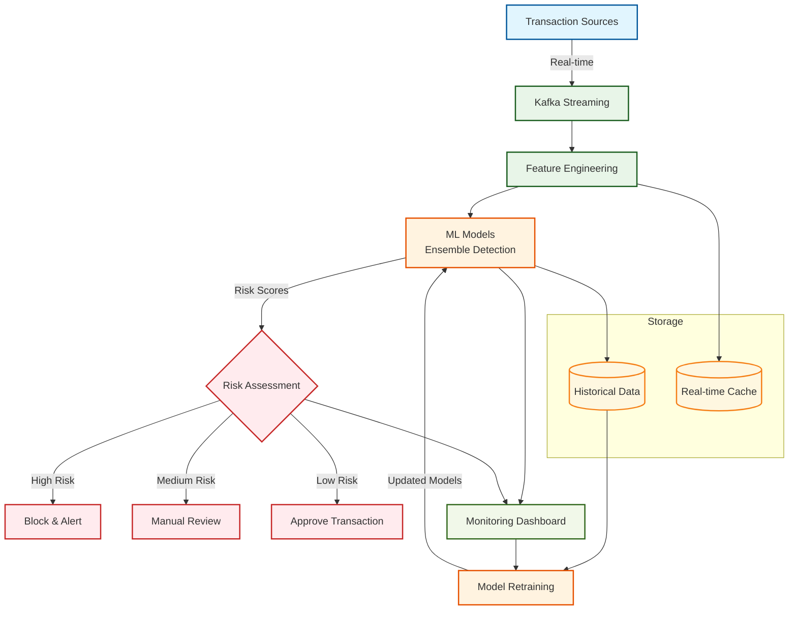

# Anomaly Detection System

```mermaid
graph TD
    A[Transaction Sources] -->|Real-time| B[Kafka Streaming]
    B --> C[Feature Engineering]
    C --> D[ML Models<br/>Ensemble Detection]
    D -->|Risk Scores| E{Risk Assessment}
    
    E -->|High Risk| F[Block & Alert]
    E -->|Medium Risk| G[Manual Review]
    E -->|Low Risk| H[Approve Transaction]
    
    subgraph Storage
        I[(Historical Data)]
        J[(Real-time Cache)]
    end
    
    C --> J
    D --> I
    K[Model Retraining] -->|Updated Models| D
    I --> K
    
    L[Monitoring Dashboard] --> K
    D --> L
    E --> L
    
    classDef source fill:#e1f5fe,stroke:#01579b,stroke-width:2px
    classDef processing fill:#e8f5e8,stroke:#1b5e20,stroke-width:2px
    classDef ml fill:#fff3e0,stroke:#e65100,stroke-width:2px
    classDef decision fill:#ffebee,stroke:#c62828,stroke-width:2px
    classDef storage fill:#fef7e0,stroke:#f57f17,stroke-width:2px
    classDef monitoring fill:#f1f8e9,stroke:#33691e,stroke-width:2px
    
    class A source
    class B,C processing
    class D,K ml
    class E,F,G,H decision
    class I,J storage
    class L monitoring
```
