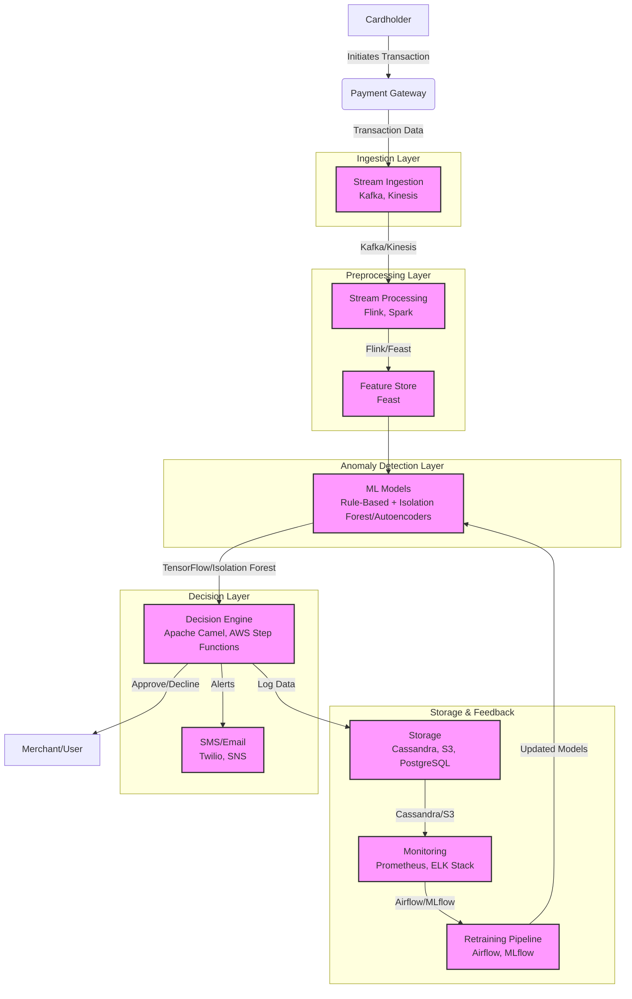

# Anomaly Detection System

```mermaid
graph TD
    A[Cardholder] -->|Initiates Transaction| B(Payment Gateway)
    B -->|Transaction Data| C[Ingestion Layer]
    C -->|Kafka/Kinesis| D[Preprocessing Layer]
    D -->|Flink/Feast| E[Feature Store]
    E --> F[Anomaly Detection Layer]
    F -->|TensorFlow/Isolation Forest| G[Decision Layer]
    G -->|Approve/Decline| H[Merchant/User]
    G -->|Alerts| I[Notification Service]
    G -->|Log Data| J[Storage Layer]
    J -->|Cassandra/S3| K[Monitoring & Feedback]
    K -->|Airflow/MLflow| L[Model Retraining]
    L -->|Updated Models| F

    subgraph Ingestion Layer
        C[Stream Ingestion<br>Kafka, Kinesis]
    end
    subgraph Preprocessing Layer
        D[Stream Processing<br>Flink, Spark]
        E[Feature Store<br>Feast]
    end
    subgraph Anomaly Detection Layer
        F[ML Models<br>Rule-Based + Isolation Forest/Autoencoders]
    end
    subgraph Decision Layer
        G[Decision Engine<br>Apache Camel, AWS Step Functions]
        I[SMS/Email<br>Twilio, SNS]
    end
    subgraph Storage & Feedback
        J[Storage<br>Cassandra, S3, PostgreSQL]
        K[Monitoring<br>Prometheus, ELK Stack]
        L[Retraining Pipeline<br>Airflow, MLflow]
    end

    classDef layer fill:#f9f,stroke:#333,stroke-width:2px;
    class C,D,E,F,G,I,J,K,L layer;
```
