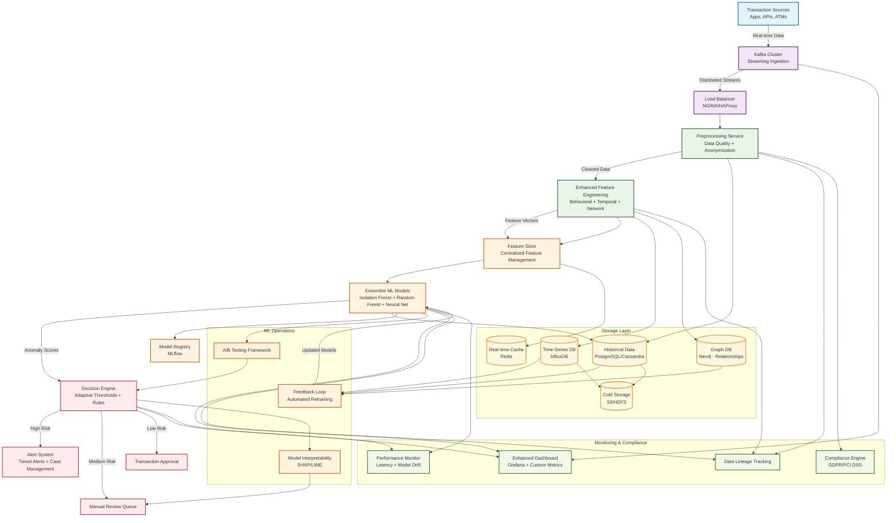

# Anomaly Detection System

```mermaid
graph TD
    A[Transaction Sources<br/>Apps, APIs, ATMs] -->|Real-time Data| B[Kafka Cluster<br/>Streaming Ingestion]
    B -->|Distributed Streams| C[Load Balancer<br/>NGINX/HAProxy]
    C --> D[Preprocessing Service<br/>Data Quality + Anonymization]
    D -->|Cleaned Data| E[Enhanced Feature Engineering<br/>Behavioral + Temporal + Network]
    E -->|Feature Vectors| F[Feature Store<br/>Centralized Feature Management]
    F --> G[Ensemble ML Models<br/>Isolation Forest + Random Forest + Neural Net]
    G -->|Anomaly Scores| H[Decision Engine<br/>Adaptive Thresholds + Rules]
    H -->|High Risk| I[Alert System<br/>Tiered Alerts + Case Management]
    H -->|Medium Risk| J[Manual Review Queue]
    H -->|Low Risk| K[Transaction Approval]
    
    subgraph Storage Layer
        L[(Time-Series DB<br/>InfluxDB)]
        M[(Graph DB<br/>Neo4j - Relationships)]
        N[(Historical Data<br/>PostgreSQL/Cassandra)]
        O[(Real-time Cache<br/>Redis)]
        P[(Cold Storage<br/>S3/HDFS)]
    end
    
    subgraph ML Operations
        Q[A/B Testing Framework]
        R[Model Registry<br/>MLflow]
        S[Feedback Loop<br/>Automated Retraining]
        T[Model Interpretability<br/>SHAP/LIME]
    end
    
    subgraph Monitoring & Compliance
        U[Enhanced Dashboard<br/>Grafana + Custom Metrics]
        V[Data Lineage Tracking]
        W[Compliance Engine<br/>GDPR/PCI DSS]
        X[Performance Monitor<br/>Latency + Model Drift]
    end
    
    D --> N
    E --> F
    E --> L
    E --> M
    F --> O
    G --> N
    G --> R
    S -->|Updated Models| G
    N --> S
    L --> S
    M --> S
    
    G --> Q
    Q --> H
    H --> T
    T --> J
    
    B --> U
    G --> U
    H --> U
    D --> V
    E --> V
    G --> V
    D --> W
    G --> X
    H --> X
    
    N --> P
    L --> P
    
    classDef source fill:#e1f5fe,stroke:#01579b,stroke-width:2px
    classDef streaming fill:#f3e5f5,stroke:#4a148c,stroke-width:2px
    classDef processing fill:#e8f5e8,stroke:#1b5e20,stroke-width:2px
    classDef ml fill:#fff3e0,stroke:#e65100,stroke-width:2px
    classDef storage fill:#fef7e0,stroke:#f57f17,stroke-width:2px
    classDef decision fill:#ffebee,stroke:#c62828,stroke-width:2px
    classDef monitoring fill:#f1f8e9,stroke:#33691e,stroke-width:2px
    
    class A source
    class B,C streaming
    class D,E processing
    class F,G,Q,R,S,T ml
    class L,M,N,O,P storage
    class H,I,J,K decision
    class U,V,W,X monitoring
```
