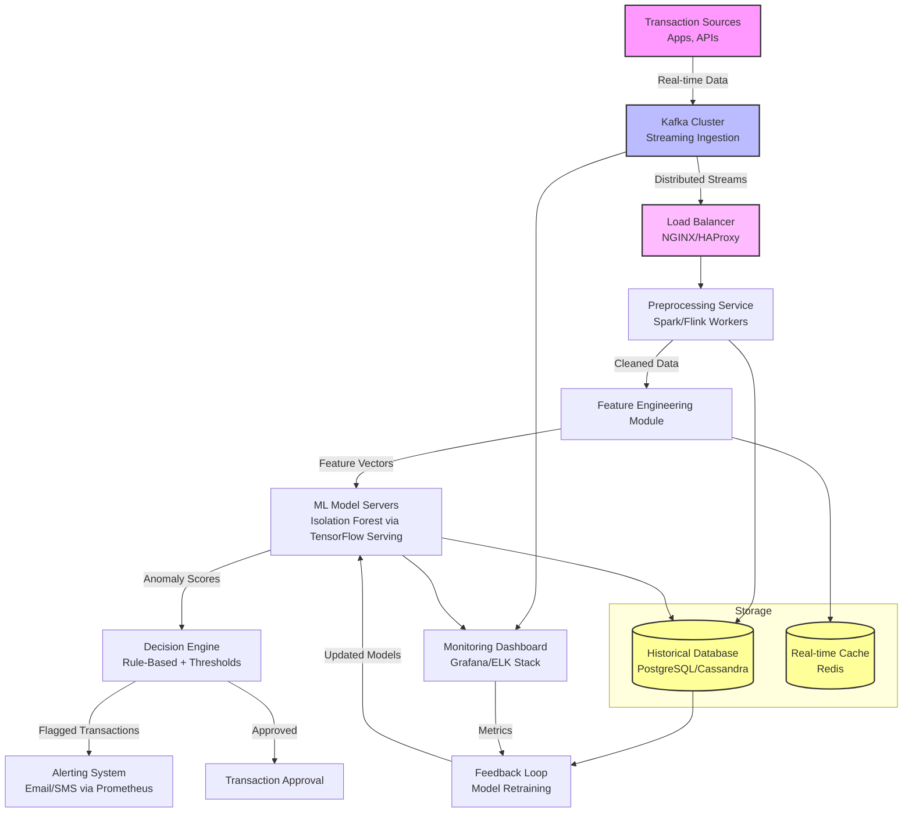

# Anomaly Detection System

```mermaid
graph TD
    A[Transaction Sources<br/>Apps, APIs] -->|Real-time Data| B[Kafka Cluster<br/>Streaming Ingestion]
    B -->|Distributed Streams| C[Load Balancer<br/>NGINX/HAProxy]
    C --> D[Preprocessing Service<br/>Spark/Flink Workers]
    D -->|Cleaned Data| E[Feature Engineering Module]
    E -->|Feature Vectors| F[ML Model Servers<br/>Isolation Forest via TensorFlow Serving]
    F -->|Anomaly Scores| G[Decision Engine<br/>Rule-Based + Thresholds]
    G -->|Flagged Transactions| H[Alerting System<br/>Email/SMS via Prometheus]
    G -->|Approved| I[Transaction Approval]
    
    subgraph Storage
        J[(Historical Database<br/>PostgreSQL/Cassandra)]
        K[(Real-time Cache<br/>Redis)]
    end
    
    D --> J
    E --> K
    F --> J
    L[Feedback Loop<br/>Model Retraining] -->|Updated Models| F
    J --> L
    M[Monitoring Dashboard<br/>Grafana/ELK Stack] -->|Metrics| L
    B --> M
    F --> M
    
    classDef source fill:#f9f,stroke:#333,stroke-width:2px
    classDef streaming fill:#bbf,stroke:#333,stroke-width:2px
    classDef processing fill:#fbf,stroke:#333,stroke-width:2px
    classDef storage fill:#ff9,stroke:#333,stroke-width:2px
    
    class A source
    class B streaming
    class C processing
    class J,K storage
```
